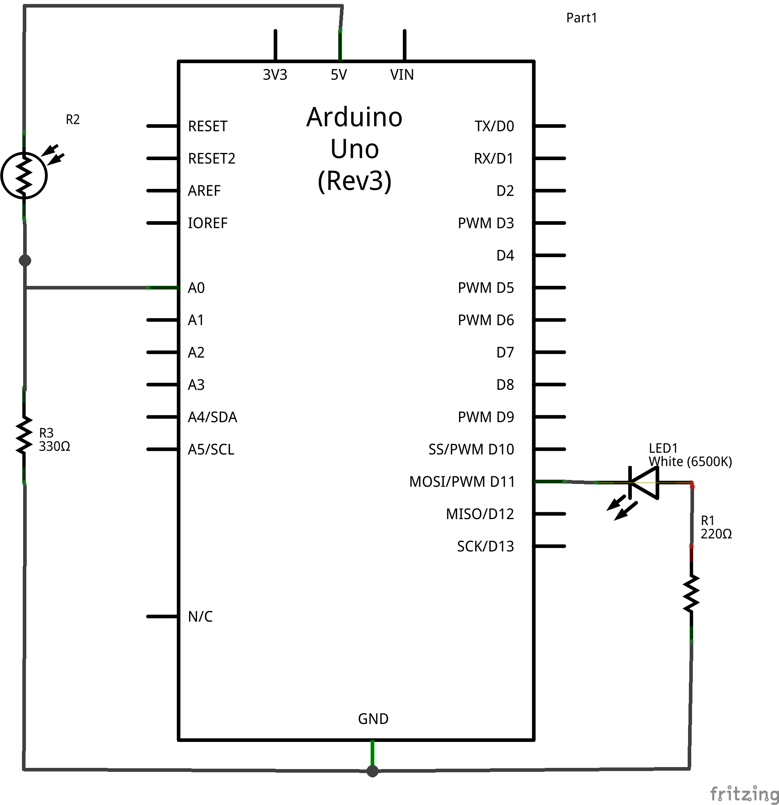
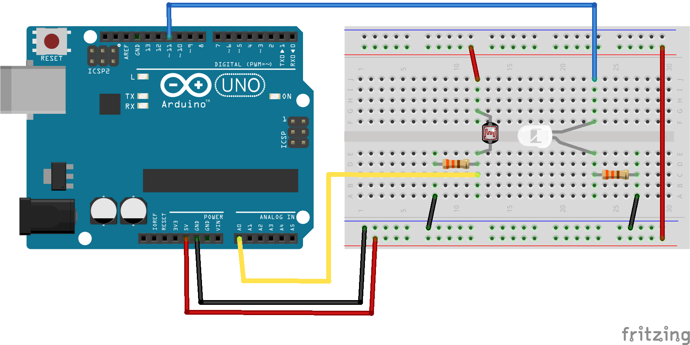

.. $Id$

.. _epid_circuit:

=================================================
Electronic Circuit
=================================================

.. note:: under construction

.. _fig.epid_schematic:

    Electronic Circuit Schematic: Arduino, photocell, and LED
    (:download:`LED_sensor_schem.png`)

.. _fig.epid_breadboard:

    Electronic Circuit Breadboard: Arduino, photocell, and LED
    (:download:`LED_sensor_bb.png`)

.. put a photo of the circuit here

.. tip:: Reduce the background light that reaches the photocell.
   Place the photocell and LED inside a piece of black tubing.
   
   Suggestions for a black tube: 
   * piece of shrink wrap (don't shrink it!)
   * the outer insulation from a multiconductor cable

Fritzing layout
----------------

The circuit was layed out using the Fritzing software
(http://fritzing.org).  
Download the layout file here: :download:`LED_sensor.fzz`.
