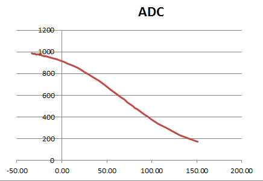

.. $Id$

.. index:: EPICS; database

.. _pv.database:

EPICS database
##############

An EPICS database file is used to create specific record instances
that will be used by an IOC.  It declares them by defining the name
and EPICS record type.  The name can be fully declared, such as *time*
or can be completed later by expansion of a macro definition, such as 
*$(P)cmd*.  The value of the macro will be specified in the IOC 
startup script, either through a call to *dbLoadRecords()* or *dbLoadTemplate()*.

This file is written to be used by more than one IOC, so it uses
a common macro for the IOC prefix (*$(P)*).  In our example IOC,
we'll call this database file as (noting *P* is set to ``como:cr:``)::

  dbLoadRecords("$(CMD_RESPONSE)/cmd_response.db","P=como:cr:,PORT=usb0")

(More on this in the section titled: :ref:`IOC.commands`.)

record instances
****************

================  =========  ==========================================================================
name              RTYP       description
================  =========  ==========================================================================
``$(P)ai0``       ai	     read the raw photocell sensor, :math:`V_P`
``$(P)ai0:mean``  ai	     photocell sensor, :math:`V_P`
``$(P)ai1``       ai	     read the LED's PWM "voltage", :math:`V_{LED}`
``$(P)ai1:mean``  ai	     read LED "voltage", :math:`V_{LED}`
``$(P)ai2:mean``  ai	     read temperature sensor, :math:`V_T` (see :ref:`temperature_sensor`)
``$(P)ai2:mean``  ai	     read reference voltage, :math:`V_{cc}` (see :ref:`temperature_sensor`)
``$(P)pwm11``     ao	     set the LED brightness (effectively: set :math:`V_{LED}`)
``$(P)rate``      ai	     read the update rate
``$(P)period``    ao	     set the averaging period, s
``$(P)epid``      epid	     Feedback control (see :ref:`epid_example`)
``$(P)cmd``       stringout  send command directly to Arduino and read response
================  =========  ==========================================================================

* *RTYP*: EPICS record type

Additional fields have been added as appropriate (from the examples shown in
:ref:`streams.protocol`):

=====  ================================================
field  description
=====  ================================================
DESC   descriptive text about this record instance
EGU    engineering units
PREC   display precision
HOPR   high limit for display purposes
LOPR   low limit for display purposes
DRVH   maximum allowed value
DRVL   minimum allowed value
PINI   process the record instance when EPICS starts
SCAN   how frequently to process this record
VAL    initial value for the record instance
=====  ================================================

The `epid <http://cars9.uchicago.edu/software/epics/epidRecord.html>`_
record instance will be explained in another section (:ref:`epid_example`).

file: ``cmd_reponse.db``
************************

The file is too large for this documentation.

:EPICS database:
   :download:`cmd_response.db <../../../epics/cmd_response.db>`

.. index:: thermistor; temperature sensor, signal; thermistor

.. _temperature_sensor:

temperature sensor
******************

It is easy to measure temperature so let's add that.
A thermistor varies its resistance with temperature.  
The temperature can be measured using a voltage divider circuit.

.. figure:: thermistor.png
       :alt: fig.thermistor
       :width: 70%
       :align: center

       Voltage divider circuit with the thermistor
       (:download:`thermistor.png`)

We'll connect the thermistor voltage signal, :math:`V_T`, 
to the Arduino's ANALOG IN A2 pin and the supply voltage, :math:`V_{cc}`,
to pin A3.  Having actual measurements of :math:`V_{cc}` will improve our
precision of temperature reporting.

For a 10 kOhm (:math:`R_{ref}=10\mbox{ kOhm}`) 
negative temperature coefficient thermistor, 
we'll use a 10 kOhm
resistor (:math:`R_4=10\mbox{ kOhm}`) to balance the voltage divider
so that its response is most sensitive at its reference temperatue (25 C).
We measure the thermistor voltage, :math:`V_T`, 
and calculate its resistance, :math:`R_T`:

.. math:: R_T = R_4 { V_T / V_{cc} \over 1 - V_T / V_{cc} }

The temperature, :math:`T`, is a non-linear function of  :math:`R_T`.  Taking
:math:`r=ln(R_T / R_{ref})` as a reduced resistance term to simplify the math,
we use the *extended “Steinhart and Hart"* interpolation ([#vishay]_):

.. math:: T = {1 \over A_1 + B_1 r + C_1 r^2 + D_1 r^3}

.. tip::  It's easier to do the computation in EPICS records 
   rather than the Arduino.

Using coefficients (Vishay thermistor, 10k NTC, :math:`\beta=3977\mbox{ K}`) 
from the manufacturer's data sheet [#vishay]_:

== =============
A1 3.354016E-03
B1 2.569850E-04
C1 2.620131E-06
D1 6.383091E-08
== =============

we can now compute a curve for the signal we expect to measure.  
See the next figure:

       Arduino ANALOG IN A2 units plotted as a function of temperature (F)
       for 10k NTC, :math:`\beta=3977\mbox{ K}` thermistor.
       (:download:`ADC_vs_T_curve.png`)

.. [#vishay] http://www.vishay.com/product?docid=29049
