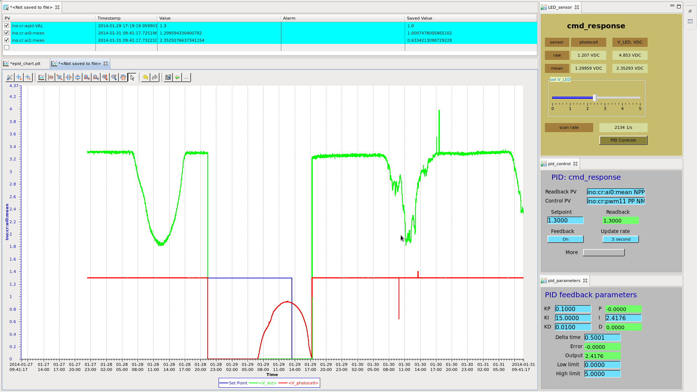

.. $Id$

.. index:: example; EPICS epid record

.. _epid_example:

===========================================
Example: Feedback using the ``epid`` record
===========================================

.. note: this page is under construction

.. index:: EPICS; epid

This example builds on the previous example where a sensor 
creating a *signal* was connected to the Arduino and monitored 
from EPICS.  An LED was connected to the Arduino to 
*control* (or modify) the first signal.

.. index:: constant lighting

This example will control the output of the LED based on the signal from the sensor.
We'll test our controls by changing the background lighting levels and the
desired signal level from the sensor.  In effect, we are building 
**constant lighting** (maintaining a constant level of illumination).

Requirements:

* Arduino system with specified electronics circuit (:ref:`example_circuit`)
* Linux computer with Arduino interface
* EPICS IOC configured to communicate with Arduino
* CSS BOY client for EPICS [#]_

The EPICS *epid* record [#epid]_ is used to continuously update the 
*control* based on updates to the *signal* with the goal of 
driving the signal to a desired *set point*.  The *epid* record 
provides an extended Proportional-Integral-Derivative controller 
(for more information about PID control, see, for example, 
these documents from the University of 
Michigan: [#]_, [#]_, [#UMich]_) to a process configured by EPICS PVs. 
Additional equations are sketched out [#]_ that convert the terms 
of the UMich documentation into terms of the *epid* record.

.. index:: PID theory

Basic PID Theory
================

.. index:: !process error, following error

At its heart, PID control is implemented to maintain a time-dependent, 
measured signal, :math:`M(t)`, at a desired value, :math:`D(t)` 
by adjusting a control, :math:`Y(t)`.  The general PID equation is based
on the concept of a *process error*, :math:`\epsilon(t)`, that is the 
difference between the actual and desired values of the signal:

.. math::

   \epsilon(t) = M(t) - D(t)

general PID equation ([#UMich]_):

.. math::

  Y(t) = K_c \left[ { \epsilon(t) + {1 \over T_i}\int_0^t \epsilon(t_i)d{t_i} + T_d {d\epsilon(t) \over dt} } \right] + Y(t_0)

*epid* record PID equation ([#epid]_):

.. math::

  Y_n = K_P \epsilon(t) + K_P K_I \sum_i {\epsilon_i \delta t_i} + K_P K_D {\epsilon_n - \epsilon_{n-1} \over \delta t_n}

.. note:: The process error, :math:`\epsilon(t)`, is also
   known as various other names, such as *following error*.

Outline
=======

.. define the example

Definition of Terms
===================

.. index::
   single: Kp - proportional gain
   single: Ki - integral gain
   single: Kd - derivative gain
   single: process error

====================== =================================================================
term                   description
====================== =================================================================
:math:`t`              time
:math:`M(t)`           measured input **signal** as a function of time
:math:`D(t)`           **set point** (desired value of **signal**) as a function of time
:math:`Y(t)`           chosen **control** output as a function of time
:math:`\epsilon(t)`    **process error**: :math:`\epsilon(t) = M(t) - D(t)`
:math:`K`              generalized process **gain**:  :math:`K = {\hbox{change in output} \over \hbox{change in input}}`
:math:`K_c`            process **gain** constant (from theory, to be determined empirically)
:math:`T_i`            process integral coefficient (from theory, to be determined empirically)
:math:`T_d`            process derivative coefficient (from theory, to be determined empirically)
:math:`K_P`            proportional gain coefficient (EPICS user input):  :math:`K_P = K_C`
:math:`K_I`            integral gain coefficient (EPICS user input):  :math:`K_I = {K_C / T_i}`
:math:`K_D`            derivative gain coefficient (EPICS user input):  :math:`K_D = K_C T_d`
:math:`\tau`           time for response to complete
:math:`\tau_d`         dead time before system starts to respond
:math:`\delta t`       time between samples
====================== =================================================================

.. _epid.configuration:

Configuration of *epid*
=====================================

.. describe the *epid* configuration (starting with default)

-tba-

.. _adjust.pid.terms:

Adjusting :math:`K_p`, :math:`K_i`, and :math:`K_d`
==========================================================

.. set an initial value of :math:`K_p`

-tba-

.. _measure.system.response:

Measure the System Response
===========================

Once the PID parameters are adjusted for the local particulars,
the performance can be demonstrated by charting :math:`D(t)`,
:math:`M(t)`, and :math:`Y(t)`.  The next figure shows such
a chart for a few days in January, Chicago area.

   
   Example operation of *epid* feedback for several days
   (:download:`CSSBOY_epid_chart.png`).  Colors:
   :math:`D(t)` (set point, blue),
   :math:`M(t)` (photocell, red),
   :math:`Y(t)` (LED, green)

.. sidebar:: Average :math:`Y(t)`

   Here, we say :math:`Y(t)` when we actually refer the
   time-averaged :math:`\left<Y(t)\right>` reported as *mean V_LED, VDC*.
   The instantaneous V_LED takes the values of 0 or :math:`V_{cc}`
   as the PWM modulates the apparent brightness of the LED.
   
   :PWM: 
      * http://arduino.cc/en/Tutorial/PWM
      * http://arduino.cc/en/Tutorial/SecretsOfArduinoPWM

The chart, at first, shows steady-state operations of a tuned PID loop.
With :math:`M(t)=\mbox{1.3}`, the loop varies the LED brightness (:math:`Y(t)`)
to hold :math:`M(t)` steady.  At night, the LED is brightest.  During the day,
the LED brightness is reduced to maintain the chosen set point.  

Some time on 01-28, the *epid* feedback was turned off (manually) and
:math:`Y(t)` was set to zero.  In this case, the ambient light level 
is recorded by :math:`M(t)`.  On 01-29, :math:`D(t)` was also set to zero.
Since the *epid* loop was off, this change had not effect.  Note that in 
the overnight period, the sensor was not able to detect variations in
the ambient darkness.  Selection of different resistors would improve the 
nighttime sensitivity but that is for a different project.  With the 
feedback on, the signal is within range of both the photocell and the
LED such that :math:`Y(t)` can be used to correlate lighting conditions
at any time of day or night.

Later on 01-29, the *epid* feedback was resumed and the loop locked in 
within the charted sampling period.  Actual time for lockin with the terms
shown was within 10 seconds.

.. Note that :math:`Y(t)` has much less apparent
   jitter than :math:`Y(t)`.

Spikes in the photocell signal, :math:`M(t)`, appear on 01-30 and are
likely due to USB communications errors between EPICS and the Arduino.
The short-lived spikes have no obvious effect on the *epid* operations.

The variations of :math:`Y(t)` on 01-30 correlate with ambient conditions
on that day (reflections from passing traffic, lighting, weather) and indicate
the response of the *epid* controls to changing conditions as it
maintains the chosen set point.

When *epid* feedback is turned on, the lighting level is held constant.
At this point, we declare *success* and finish this document.

References
==========

.. [#] CSS BOY, http://ics-web.sns.ornl.gov/css/products.html
.. [#epid] http://cars9.uchicago.edu/software/epics/epidRecord.html
.. [#] https://controls.engin.umich.edu/wiki/index.php/Main_Page#PID_control
.. [#] https://controls.engin.umich.edu/wiki/index.php/Main_Page
.. [#UMich] https://controls.engin.umich.edu/wiki/index.php/PIDTuningClassical 
.. [#] notes: :download:`131108115836_0001.pdf`
