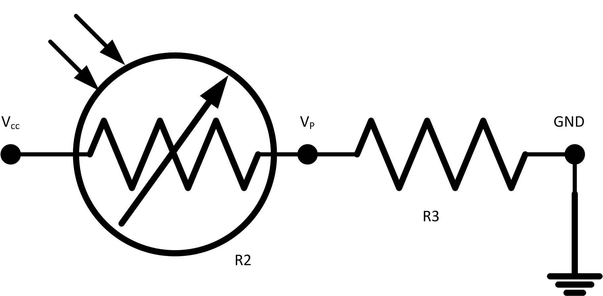
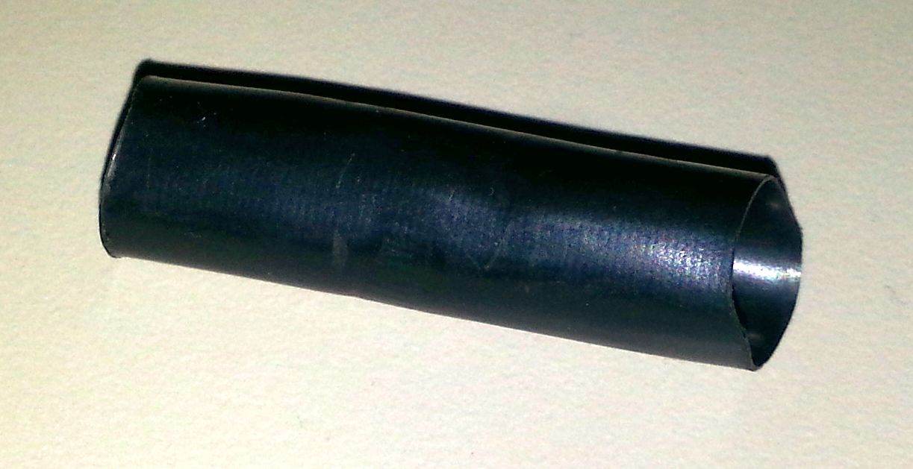

.. _example_circuit:

=====================================
Electronic Circuit: photocell and LED
=====================================

The **cmd_response** sketch is very general with respect 
to the ANALOG IN and DIGITAL I/O of the Arduino boards.
We can use it to read a wide variety of sensors from 
remote computer systems.

First, we demonstrate how the Arduino **cmd_response** 
sketch works, we construct some simple sensor circuits
and then communicate with our Arduino with a Python
program (see: :ref:`python_sequence`).

Later, we integrate the Arduino with EPICS (see: :ref:`epics`).  
Finally, we maintain a constant sensor value (photocell)
by adjusting an LED's brightness using a PID loop in EPICS 
(see: :ref:`epid_example`).

.. index:: photocell; light sensor, signal; photocell

photocell
---------

The photocell is a cadmium-sulfide photosensitive resistor.  [#]_
It is an inexpensive device that measures the amount of light
reaching its active surface.  The resistance of the photocell, R2, changes
as the intensity of light changes.

An easy way to sense this resistance is to build a simple voltage divider 
circuit such as the next figure and measure voltage, :math:`V_P`
at the midpoint of the circuit between R2 and R3.  

.. math::  V_P = V_{cc} \left( {R2 \over R2 + R3} \right)

Since the resistance of the photocell, R2,
drops with increasing light intensity, we choose to put it
closer to the supply voltage, :math:`V_{cc}` [#]_.  As the light intensity
increases, :math:`V_P` will increase towards :math:`V_{cc}`.  The other 
resistor, R3, is chosen to limit the maximum current through the divider
as R2 tends towards zero.

       Voltage divider circuit with the photocell
       (:download:`photocell-schem.png`)

:connection: 
   We'll connect :math:`V_P` to ANALOG IN channel A0.

.. [#] photocell: http://en.wikipedia.org/wiki/Photoresistor
.. [#] Take :math:`V_{cc}` from the Arduino's 5 VDC supply.

.. index:: LED; light generator, signal; LED

LED
---

The LED is an inexpensive device that generates 
light when a current is passed through it.
A resistor is used to limit the current which
flows through the LED as it is driven from one of the DIGITAL
pins on the Arduino.  Arduino has an example to vary the intensity of the LED
using pulse-width modulation and the ``analogWrite()`` function.  [#]_

 .. figure:: LED_schem.png
       :alt: fig.LED_schem
       :width: 80%
       :align: center

       Lighting an LED with an applied voltage.
       (:download:`LED_schem.png`)

The current that flows through the LED, :math:`i_{LED}` is given by:

.. math::  i_{LED} = {V_{LED} - V_{drop} \over R1}

Only 10-30 mA should be given to :math:`i_{LED}`.  
The forward drop voltage, :math:`V_{LED}`, is probably about 1.6 VDC.  
With R1 = 330 Ohms and :math:`V_{LED}=5` VDC (full output from a DIGITAL pin),
then :math:`i_{LED}=10` mA.  We could choose a lower R1, 
allowing more current through the LED.  Try this for yourself.

.. note::  The intensity of light from LED1 is not linear with PWM value.

:connection: 
   We'll connect :math:`V_{LED}` to DIGITAL (pwm) channel D11.

.. [#] LED Fading: http://arduino.cc/en/Tutorial/Fade

.. index:: circuit

Complete circuit
----------------

The LED is connected to D11 and the photocell is connected to A0 on the Arduino.

As an additional sensor, let's monitor the voltage at the LED, 
:math:`V_{LED}`, by adding a wire from D11 to A1.  
Here is the full circuit schematic:

.. _fig.epid_schematic:

.. figure:: LED_sensor_schem.png
    :alt: fig.epid_schematic
    :width: 50%
    :align: center

    Electronic Circuit Schematic: Arduino, photocell, and LED
    (:download:`LED_sensor_schem.png`)

This circuit is very simple and a small project breadboard
will make it easy to build.

.. _fig.epid_breadboard:

.. figure:: LED_sensor_bb.png
    :alt: fig.epid_breadboard
    :width: 80%
    :align: center

    Electronic Circuit Breadboard: Arduino, photocell, and LED
    (:download:`LED_sensor_bb.png`)

.. tip:: LEDs are polarized devices.  If you install them
   backwards, they won't produce light.  Review
   how they look at this web site:
   http://www.bcae1.com/led.htm

Since we want to measure the light intensity from the LED
using the photocell, it makes some sense to position them 
close together on the breadboard and bend their leads so
they face each other.  Here's how it might look:

.. TODO: needs a better photo where the wires do not get in the way

.. _fig.circuit-bare:

.. figure:: circuit-bare.jpg
    :alt: fig.circuit-bare
    :width: 80%
    :align: center

    Electronic Circuit: Arduino, photocell, and LED
    (:download:`circuit-bare.jpg`)

Reduce background light
-----------------------

Depending on conditions at your desk, the light measured
by your photocell may be significant, even when the
LED is off!  If you wish to concentrate on just the light
emitted from the LED, then consider placing the photocell 
and LED in a dark place.  Compare the difference between places.

.. tip:: Reduce the background light that reaches the photocell.
   Place the photocell and LED inside a dark place.
   
Suggestions for a dark place: 

* place arduino and breadboard inside a box

* place arduino and breadboard under a dark blanket (do *not* short-circuit the board!)

* cover just the photocell and LED with a shroud

 * a piece of shrink wrap (don't shrink it!)

 * the outer insulation from a multiconductor cable

The shroud idea lets us see the circuit as we proceed.
We'll shroud the photocell and LED using some black tubing.
Choose either a piece of shrink wrap or insulation from a cable.
Pick a piece just large enough to fit over the LED and photocell, 
such as 10 mm diameter.  The exact size does not matter.  
Just try to reduce the background light that reaches the photocell.

Here's our shroud using a piece of cable insulation:

.. _fig.shroud:

    Shroud to be added.
    (:download:`shroud.jpg`)

Carefully tuck the photocell and LED into opposite ends of the shroud.
Here's our circuit with the shroud installed:

.. TODO: needs a better photo where the wires do not get in the way

.. _fig.circuit-shrouded:

.. figure:: circuit-shrouded.jpg
    :alt: fig.circuit-shrouded
    :width: 80%
    :align: center

    Shroud added to reduce background light reaching the photocell.
    (:download:`circuit-shrouded.jpg`)

Fritzing layout
---------------

The circuit was described using the Fritzing software
(http://fritzing.org).  
Download the layout file here: :download:`LED_sensor.fzz`.
